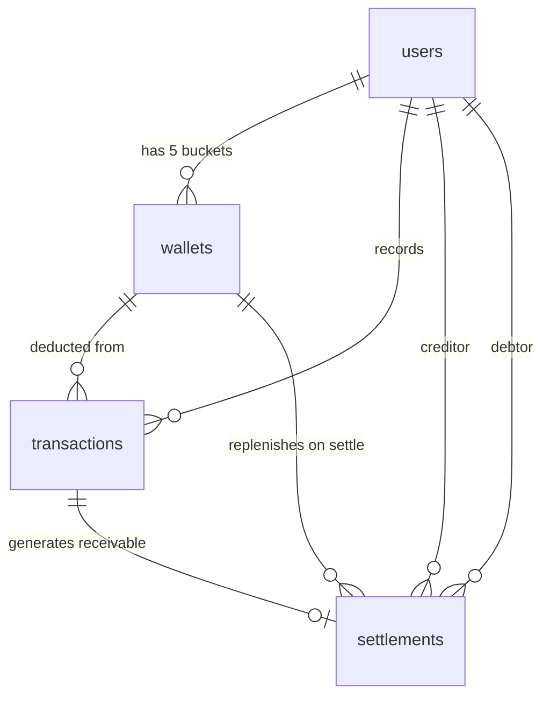

# Co-pay & Partner Settlement — Technical Analysis

## 1. Executive Summary

This document analyzes how to integrate a **Co-pay & Partner Settlement** module into KitLandVault's existing 5-bucket financial system (SCB, LHB You, Kept, DIME, K Mobile). The core challenge is differentiating between *personal expenses*, *shared expenses (50/50 split)*, and *advanced payments (100% on behalf of partner)* — while keeping income reports clean and daily budget calculations accurate.

> [!IMPORTANT]
> Reimbursements from your wife must be classified as **Wallet Replenishment**, not Income. This is a critical accounting distinction that affects every layer of the stack.

---

## 2. Database Schema Design (PostgreSQL)

### 2.1 Changes to `transactions` Table

Add three columns to the existing `transactions` table:

```sql
ALTER TABLE transactions ADD COLUMN split_type VARCHAR(20) DEFAULT 'PERSONAL';
-- PERSONAL | SHARED | ON_BEHALF

ALTER TABLE transactions ADD COLUMN my_share NUMERIC(12,2);
-- The portion that counts as MY actual expense

ALTER TABLE transactions ADD COLUMN partner_share NUMERIC(12,2) DEFAULT 0;
-- The portion owed by / attributed to wife
```

**How each scenario maps:**

| Scenario | `amount` | `split_type` | `my_share` | `partner_share` |
|---|---|---|---|---|
| Personal grocery ฿500 | 500 | `PERSONAL` | 500 | 0 |
| Shared dinner ฿2,000 | 2,000 | `SHARED` | 1,000 | 1,000 |
| Wife's phone bill ฿800 | 800 | `ON_BEHALF` | 0 | 800 |

### 2.2 New `wallets` Table (5-Bucket System)

```sql
CREATE TABLE wallets (
    id              BIGSERIAL PRIMARY KEY,
    user_id         BIGINT NOT NULL REFERENCES users(id),
    name            VARCHAR(50) NOT NULL,   -- 'SCB', 'LHB You', 'Kept', 'DIME', 'K Mobile'
    balance         NUMERIC(12,2) NOT NULL DEFAULT 0,
    daily_budget    NUMERIC(12,2),          -- only for K Mobile (~388 THB)
    budget_reset_day INT DEFAULT 1,         -- day of month budget resets
    created_at      TIMESTAMPTZ DEFAULT NOW(),
    updated_at      TIMESTAMPTZ DEFAULT NOW()
);
```

> [!NOTE]
> Each transaction should link to a `wallet_id` so that the deduction comes from the correct bucket.

### 2.3 New `settlements` Table

A dedicated table to track partner debt lifecycle:

```sql
CREATE TABLE settlements (
    id              BIGSERIAL PRIMARY KEY,
    creditor_id     BIGINT NOT NULL REFERENCES users(id),  -- you
    debtor_id       BIGINT NOT NULL REFERENCES users(id),  -- wife
    transaction_id  BIGINT REFERENCES transactions(id),    -- originating tx (nullable for manual adjustments)
    amount          NUMERIC(12,2) NOT NULL,
    type            VARCHAR(20) NOT NULL,  -- 'RECEIVABLE' | 'REPAYMENT'
    target_wallet_id BIGINT REFERENCES wallets(id),        -- which wallet gets replenished
    status          VARCHAR(20) DEFAULT 'PENDING',         -- 'PENDING' | 'SETTLED'
    settled_at      TIMESTAMPTZ,
    note            VARCHAR(255),
    created_at      TIMESTAMPTZ DEFAULT NOW()
);
```

**Key design decisions:**
- `RECEIVABLE` rows are auto-created when a `SHARED` or `ON_BEHALF` transaction is saved
- `REPAYMENT` rows are created when the "Clear Debt" button is pressed
- `target_wallet_id` tracks which wallet balance should increase on settlement

### 2.4 Updated Entity Relationship



---

## 3. Backend Logic (Java/Spring Boot)

### 3.1 Service Layer — Transaction Recording

```
TransactionService.createTransaction(dto):
  1. Deduct full `amount` from the source wallet
  2. Switch on `splitType`:
     ├─ PERSONAL → myShare = amount, partnerShare = 0
     ├─ SHARED   → myShare = amount / 2, partnerShare = amount / 2
     └─ ON_BEHALF → myShare = 0, partnerShare = amount
  3. If partnerShare > 0 → auto-create Settlement(RECEIVABLE)
  4. Save transaction, update wallet balance
```

> [!WARNING]
> The **wallet deduction is always the full amount** (you physically paid it). The `myShare` field only controls what appears in your expense reports.

### 3.2 Service Layer — Net Receivable Calculation

```java
// SettlementService.java
public BigDecimal getNetReceivable(Long creditorId, Long debtorId) {
    BigDecimal totalOwed = settlementRepo
        .sumByTypeAndStatus(creditorId, debtorId, "RECEIVABLE", "PENDING");
    BigDecimal totalRepaid = settlementRepo
        .sumByTypeAndStatus(creditorId, debtorId, "REPAYMENT", "SETTLED");
    return totalOwed.subtract(totalRepaid);
}
```

### 3.3 Service Layer — Clear Debt (Settlement)

```
SettlementService.recordRepayment(amount, targetWalletId):
  1. Create Settlement(type=REPAYMENT, status=SETTLED)
  2. Increment targetWallet.balance by amount    ← Wallet Replenishment
  3. Mark matching RECEIVABLE rows as SETTLED (FIFO order)
  4. DO NOT create an Income transaction         ← Critical!
```

> [!CAUTION]
> Never insert an `Income`-type transaction for repayments. The wallet balance increases directly via the `wallets` table. This keeps monthly/yearly income reports accurate.

### 3.4 Key API Endpoints

| Method | Endpoint | Purpose |
|---|---|---|
| `POST` | `/api/transactions` | Create tx with `splitType` field |
| `GET` | `/api/settlements/balance?partnerId=X` | Get net receivable |
| `GET` | `/api/settlements?partnerId=X` | List all receivable/repayment history |
| `POST` | `/api/settlements/repay` | Record partner repayment |
| `GET` | `/api/wallets` | List all 5 buckets with balances |
| `GET` | `/api/wallets/{id}/daily-budget` | Get remaining daily budget for K Mobile |

---

## 4. Frontend UI/UX (Angular)

### 4.1 Transaction Entry Form

```
┌─────────────────────────────────────────┐
│  New Transaction                        │
├─────────────────────────────────────────┤
│  Amount:    [ ฿ 2,000        ]          │
│  Category:  [ Dining Out     ▼ ]        │
│  Wallet:    [ K Mobile       ▼ ]        │
│                                         │
│  ┌─────────────────────────────────┐    │
│  │ ○ Personal                      │    │
│  │ ◉ Split 50/50 with Wife         │    │
│  │ ○ Paid on behalf of Wife        │    │
│  └─────────────────────────────────┘    │
│                                         │
│  💡 Your share: ฿1,000                  │
│     Wife owes:  ฿1,000                  │
│                                         │
│            [ Save Transaction ]         │
└─────────────────────────────────────────┘
```

**Key UX decisions:**
- Radio group (not toggle) since the three modes are mutually exclusive
- Real-time preview of `myShare` / `partnerShare` updates as user selects mode
- Default to "Personal" to avoid accidental split tagging

### 4.2 Dashboard — Partner Balance Widget

Add a prominent card to the existing Dashboard:

```
┌──────────────────────────────┐
│  👫 Partner Settlement       │
├──────────────────────────────┤
│  Wife owes you:              │
│  ฿ 3,450.00                  │
│                              │
│  [ Record Payment ]          │
│  [ View History → ]          │
└──────────────────────────────┘
```

### 4.3 Settlement History View

A dedicated page (`/settlements`) showing:
- Filterable list of all receivable/repayment entries
- Running balance column
- "Record Payment" modal with wallet selector (which bucket receives the money)

### 4.4 Component Structure

```
features/
├── dashboard/          ← add Partner Balance card
├── transactions/
│   └── transaction-form/   ← add split-type radio group
└── settlements/        ← NEW
    ├── settlement-dashboard/
    └── settlement-history/
```

---

## 5. Impact on Daily Budget (K Mobile ~฿388/day)

### The Question
> If K Mobile has a ฿388/day budget and you pay a ฿2,000 shared dinner from it, should the remaining daily budget reflect the ฿2,000 deduction or only the ฿1,000 (your share)?

### Recommended Approach

**Deduct the full ฿2,000 from the daily budget immediately.** The wallet physically lost ฿2,000. The daily budget should reflect *cash reality*, not accounting reality.

When your wife repays ฿1,000 back into K Mobile:
- The wallet balance increases by ฿1,000
- The remaining daily budget recalculates upward automatically
- This is the most intuitive behavior — "I see the money come back"

```
Day 15:  Budget remaining = ฿5,820 → Pay ฿2,000 shared → ฿3,820
Day 16:  Wife repays ฿1,000 to K Mobile → ฿4,820
         New daily rate = ฿4,820 / 15 remaining days = ฿321/day
```

> [!TIP]
> Consider showing a "Budget (adjusted)" tooltip on the Dashboard that shows what the daily budget *would be* if all outstanding receivables were settled. This gives you a forward-looking view without misleading the actual cash position.

---

## 6. Revised Technical Checklist

### Database
- [ ] Add `split_type`, `my_share`, `partner_share` columns to `transactions`
- [ ] Add `wallet_id` FK column to `transactions`
- [ ] Create `wallets` table (5 buckets)
- [ ] Create `settlements` table
- [ ] Write Flyway/Liquibase migration scripts
- [ ] Seed initial wallet data (SCB, LHB You, Kept, DIME, K Mobile)

### Backend (Java/Spring Boot)
- [ ] Create `Wallet` entity + repository
- [ ] Create `Settlement` entity + repository
- [ ] Modify `Transaction` entity (add new fields)
- [ ] `TransactionService` — split logic + auto-receivable creation
- [ ] `SettlementService` — net balance, repayment, wallet replenishment
- [ ] `WalletService` — balance management, daily budget calculation
- [ ] REST controllers for settlements and wallets
- [ ] Unit tests for split calculation edge cases
- [ ] Integration tests for repayment → wallet balance flow

### Frontend (Angular)
- [ ] Create `WalletService` (API integration)
- [ ] Create `SettlementService` (API integration)
- [ ] Transaction form — add split-type radio group + live preview
- [ ] Dashboard — add Partner Balance card widget
- [ ] Dashboard — add wallet balances (5-bucket overview)
- [ ] Settlement History page (`/settlements`)
- [ ] "Record Payment" modal with wallet selector
- [ ] Daily budget display for K Mobile with adjusted projection
- [ ] Responsive SCSS for all new components
